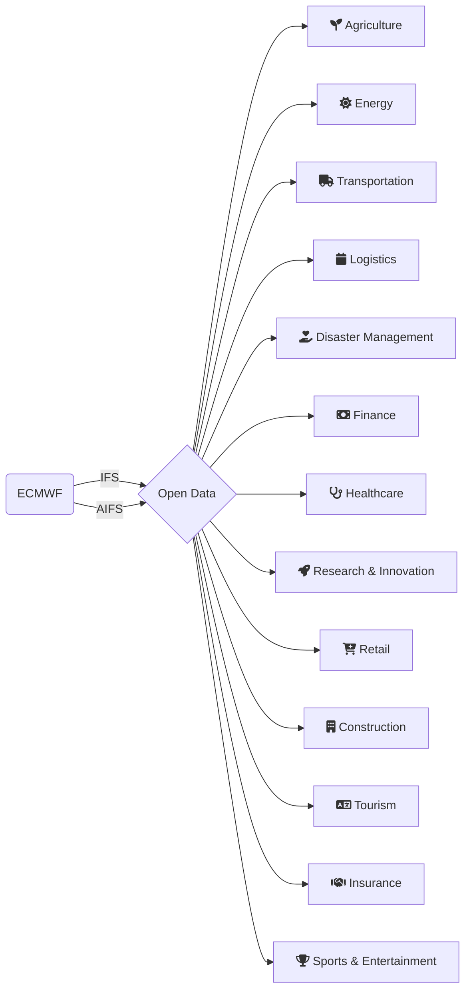

# About
---
ECMWF has committed itself to making weather data more accessible and impactful. The open meteorological data support global initiatives, such as the [Early Warning for All initiative](https://wmo.int/activities/early-warnings-all/wmo-and-early-warnings-all-initiative) of the World Meteorological Organization (WMO) and the [United Nations Office for Disaster Risk Reduction](https://www.undrr.org/) (UNDRR). ECMWF open datasets also help foster the widespread use of high-resolution data among scientific, commercial, and operational users.

:::{figure} ../images/istockphoto-openweatherdata.jpg
:label: fig:openweatherdata

Source: iStock by Getty Images
:::

Open data usage continues to grow rapidly within a broad range of industries. The third-party providers such as Open-Meteo, Amazon, Google, and Microsoft also enable access and promote open data model products worldwide.

:::{seealso}
More detailed information is available [here](https://www.ecmwf.int/node/29013).
:::

## Who will benefit from open weather data?
The ECMWF real-time open data empower a wide range of individuals, research communities, and industries as they provide crucial information for informed decisions, improve efficiency, and enhance safety in various aspects of human lives and industrial processes. 

There is a long-run relationship between ECMWF forecast data and various sectors.

:::{dropdown} Research & Innovation
The exchange of ECMWF weather data within the scientific communities can contribute to the development of new verification statistics and evaluations of forecasts and lead to the general improvement of ECMWF’s Integrated Forecasting System (IFS) as well as the long-term collaborations with external organisations. Research projects using open data are mostly related to artificial intelligence and machine learning, however, considerable interest also grows in the use of ensemble forecasts for hazard forecasting and wind and solar radiation data to predict and plan renewable energy generation.
:::

:::{dropdown} Renewable Energy
A wealth of ECMWF open data support the energy sector in unprecedented production planning and maintenance of renewable energy systems. Using these datasets, it it possible to develop tailored maps and aid policymakers and governments to select sites and invest in power plant parks with optimal resources.
:::
